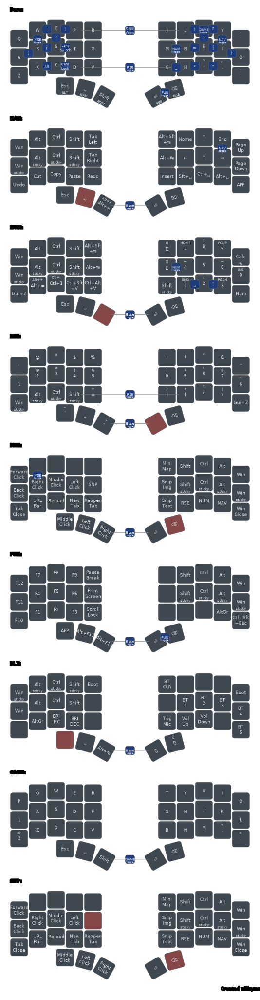
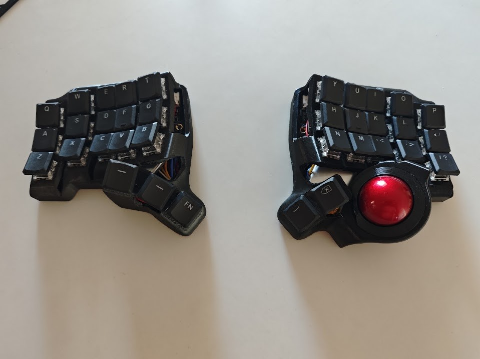

# zmk-config-charybdis-nano

ZMK config for a BastardKB-style **Charybdis Nano**, 35 keys (3x5 per half,
3 left thumbs, 2 right thumbs), integrated **PMW3610 trackball** on the right
half.

## Hardware

- Controllers: SuperMini nRF52840 (nice!nano v2 clone) → board `nice_nano_v2`
- Wireless split, **no dongle**: right half (trackball side) is the BLE central
- Trackball: PMW3610 (VDD/GND/CLK/SDIO/CS/MOTION)
- BLE name: `BD-Nano35`

Built on the [victorlucachi/zmk-keyboards-charybdis](https://github.com/victorlucachi/zmk-keyboards-charybdis)
module + [badjeff/zmk-pmw3610-driver](https://github.com/badjeff/zmk-pmw3610-driver),
with ZMK Studio enabled on the right half. ZMK is pinned to `v0.3-branch` and
the pmw3610 driver to `14d39b7a69` (see `config/west.yml`) — **do not bump
either**: newer ZMK ships an in-tree pmw3610 driver that conflicts, and newer
driver revisions probe a register this sensor rejects (dead trackball).

## Keymap

*Auto-generated by [keymap-drawer](https://github.com/caksoylar/keymap-drawer)
on every push that touches `config/` (see `.github/workflows/doc.yml`).*

Port of [Temper_zmk](https://github.com/bdimitrako/Temper_zmk) (36-key
Colemak-DH, sticky mods, combos) adapted to 35 keys:

- The 3rd right thumb key (`&lt 5 DEL`) no longer exists:
  - **FUN layer** → hold both right thumb keys together (momentary; release
    returns to base).
  - **DEL** → hold NAV (left SPACE thumb) + tap the right BSPC thumb.
- All Temper base-layer combos carried over unchanged (same positions).
- Trackball-native mouse handling:
  - pointer always active; **hold NAV = scroll** (1/3 speed, natural direction)
  - **MSE layer (4)** = hold the bottom-right pinky (tap = `;` as normal):
    pinky holds, thumb rolls the ball, and the fingers click on the
    right bottom row — **H = left, comma = right, dot = middle click**.
    Left half keeps the Temper MSE block (scroll/move keys, browser
    shortcuts, thumb clicks) for two-handed use.
  - for drags: toggle MSE with its combo instead of holding the pinky,
    `tobase` combo exits
  - no auto-mouse: tried, removed 2026-07-19 (mistriggered while typing)
- NAV zoom keys (`Ctrl -` / `Ctrl Shift =`) were dropped with the thumb key;
  media prev on BLT is now Shift+next (mod-morph).

## Flashing

1. Download the `firmware` artifact from the latest green
   [Actions](../../actions) run.
2. Double-tap the reset button on a half → it mounts as a USB drive
   (`NICENANO`).
3. Copy the matching uf2: `charybdis_right-nice_nano_v2-zmk.uf2` (right,
   Studio-enabled central), `charybdis_left-nice_nano_v2-zmk.uf2` (left).
4. If pairing misbehaves, flash `settings_reset-nice_nano_v2-zmk.uf2` to both
   halves first, then re-flash the real firmware.

> The original vendor uf2 files (BLE name "V&Z-Nano35") are the recovery
> fallback if this firmware misbehaves — keep them.

## The board

